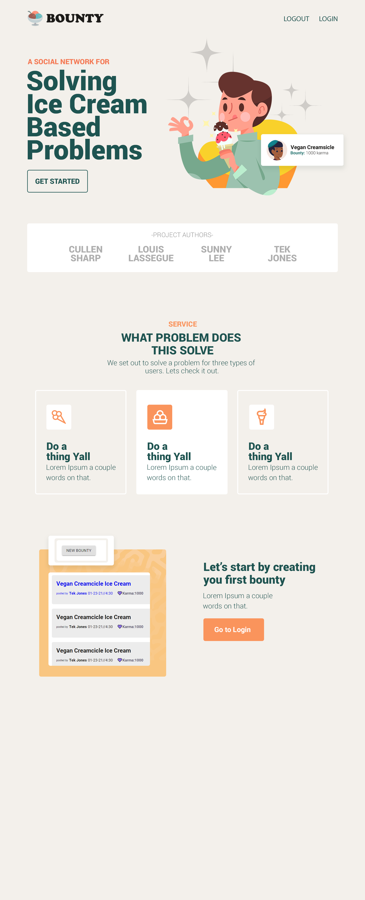

# Bounty Front

 

**Bounty** is a social network built around sharing recipes; more specifically, sharing and creating recipes for cold treats. **Bounty's** purpose is to crowd-source hard to find or non-existent recipes. Fulfill your cream-based cravings, and maybe make some friends on the way.

## 🚀 Getting Started

1. Fork our repo [GitHub](https://github.com/Creams-Quad/bounty-front)
1. Clone the repo `git clone`
1. Install dependencies `npm i`
1. Run tests `npm test`
1. Start a development server `npm start`

## 📖 Table of Contents

### [Wireframe](#-Wireframe)

### [Dependencies](#-Dependencies)

### [Our Repos](#-Our-Repos)

### [Team](#-Team)

### [More Resources](#-More-Resources)

## 🛠 Wireframe

## 👩‍💻 User Stories

1. Inquisitive user (Read)

    - As an inquisitive user I want to discuss different recipes that haven't been created yet.
    - Explore the list of bounties and then access the descriptions to see the recipes
    - Can share opinions

2. Bounty poster (Read, Create)

    - As the person that posted a bounty I want to share my ideas.
    - Add a bounty.
    - Read other opinions.

3. Bounty hunters (Read, Create, Update)

    - As a bounty hunter I want to read the recipe and then create    the recipe.
    - Marks bounties as completed.
    - Able to read the opinions for the completed recipe.

4. Guild Master (Read, Create, Update, Delete)

    - As a guild master I want to check for completed recipes and move it to the completed recipes list.
    - Move completed bounties to completed list.
    - Able to check to see if bounties are completed.

5. Competitive bounty hunter (Read, Create, Update)

    - As a competitive bounty hunter I want to create as many valid recipes to collect karma
    - Collect karma for each recipe made
    - Build karma for reputation

## 📦 Dependencies

- [Auth0 React SDK](https://auth0.com/docs/quickstart/spa/react)
- [Axios](https://www.npmjs.com/package/axios)
- [Material UI](https://material-ui.com/)
- [Node SASS](https://www.npmjs.com/package/node-sass)
- [React](https://www.npmjs.com/package/react)
- [React DOM](https://www.npmjs.com/package/react-dom)
- [React Router DOM](https://www.npmjs.com/package/react-router-dom)
- [React Scripts](https://www.npmjs.com/package/react-scripts)
- [React Testing Library](https://testing-library.com/docs/react-testing-library/intro/)
- [SASS](https://www.npmjs.com/package/sass)
- [Web Vitals](https://www.npmjs.com/package/web-vitals)

## 🚧 Our Repos

[Our API](https://github.com/Creams-Quad/bounty-back)

## 🏡 Team

[Cullen Sharp](https://github.com/CullenSharp)

[Louis Lassegue](https://github.com/mrloulass)

[Sunny Lee](https://github.com/sunny-lee3)

[Tek Jones](https://github.com/Tekthree)

## 🔍 More Resources

- [Project Management Board](https://www.notion.so/Cream-Squad-2eecc388ea1a4a70b6992435f3e885a8)
- [Bounty backend code](https://github.com/Creams-Quad/bounty-back)
- [Notion](https://www.notion.so/)
- [Team Agreement](./TeamAgreement.md)
