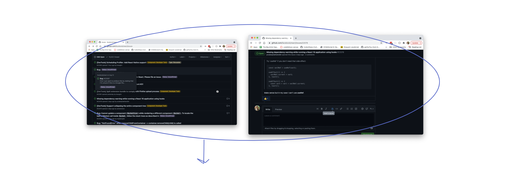
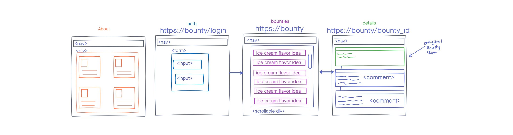
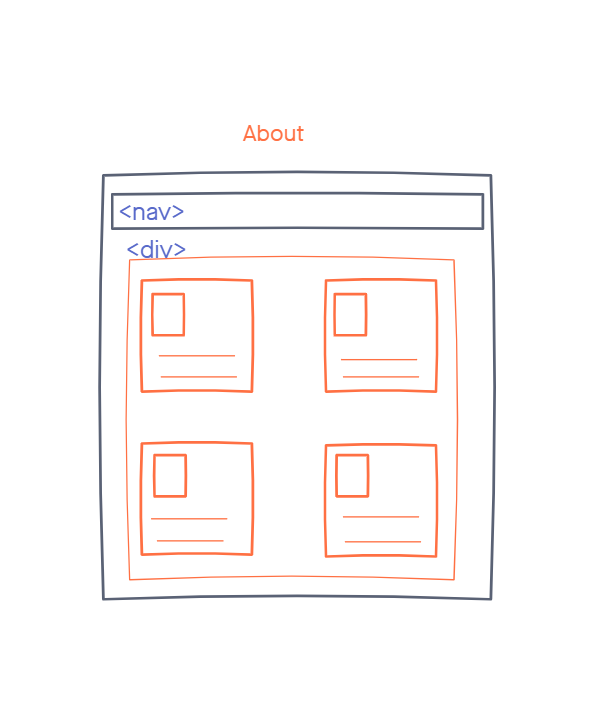
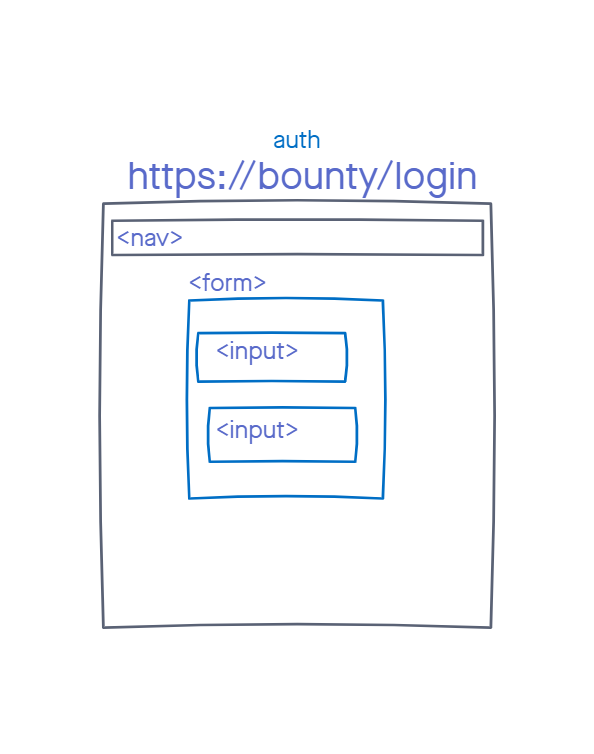
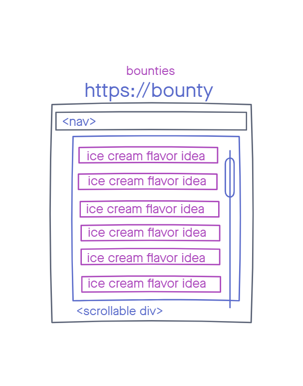
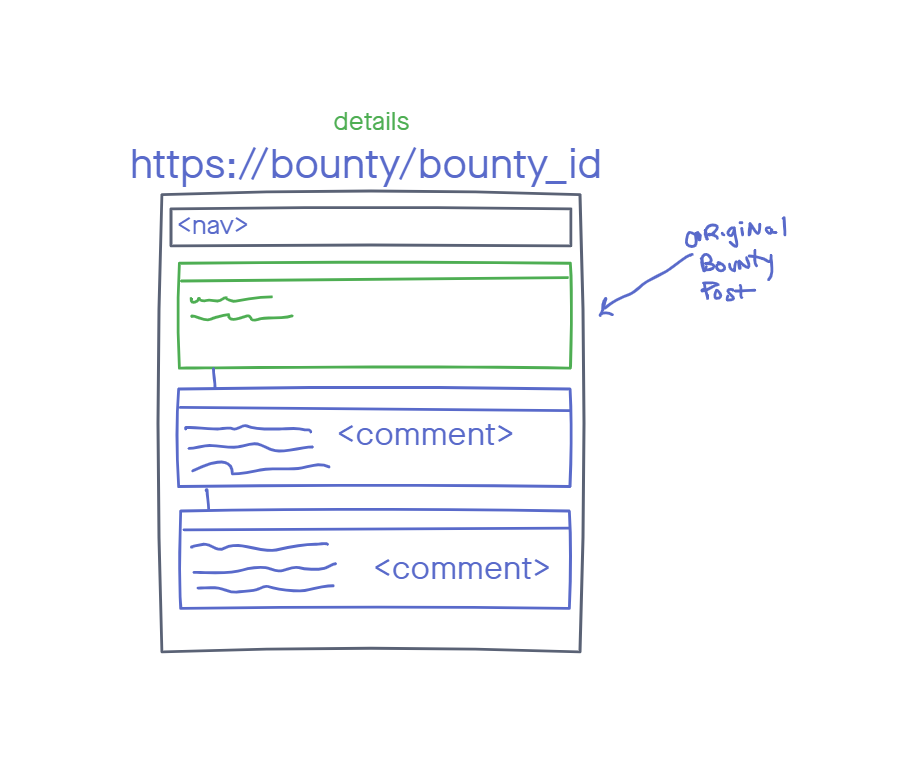
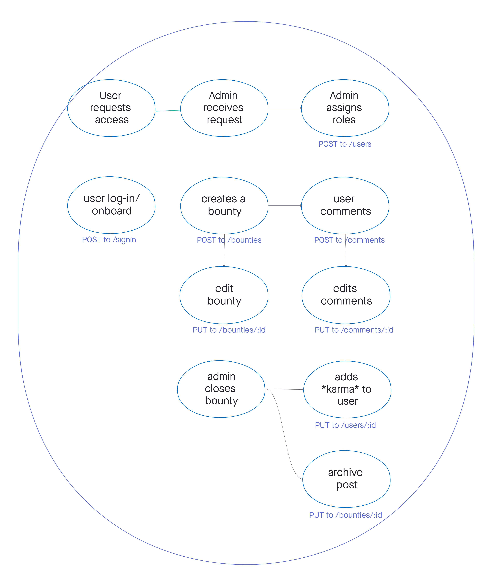
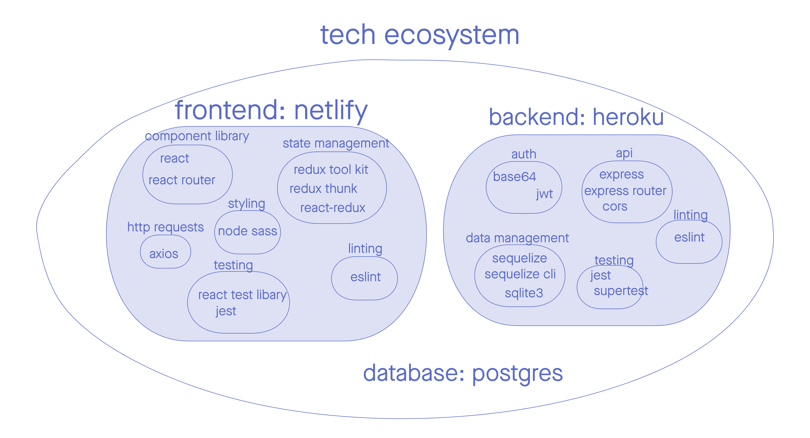
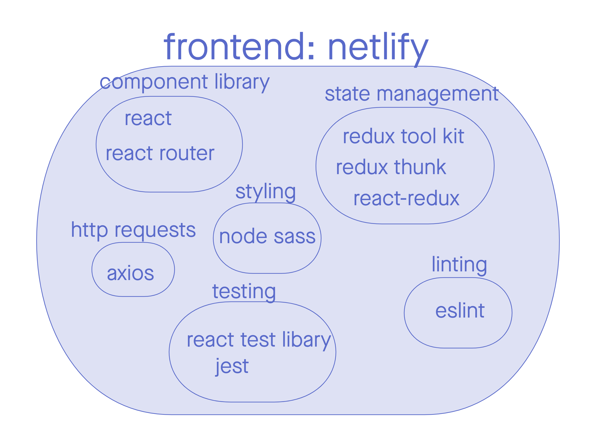

# bounty-front

# Team Cream Squad
- Cullen Sharp
- Sunny Lee
- Louis Lassgeue
- Tek Jones

## User Stories
  - [Project Board has User Stories](https://www.notion.so/User-Stories-be5412cb1ed34d62b22773eda8816897)

## UML

### Wireframe

### Domain Model

## Setup
1. To setup the app you want to first `fork` repository from [GitHub](https://github.com/Creams-Quad/bounty-back)
2. In the fork repository click the green `code` tab. A drop down to copy the repository link or url will be shown. Copy that link.
3. Go to your local machine terminal and `cd` into a directory or folder to copy link.
4. In that directory or folder type in `git clone (with the copylink)`
5. Type in `npm install` to install all dependencies for the app.

## Technologies

- [React](https://reactjs.org/docs/getting-started.html): encapsulated components that manage their own state, then compose them to make complex UIs.
- [React Router](https://reactrouter.com/web/guides/quick-start): is a collection of navigational components that compose declaratively with your application. 
- [Redux Tool Kit](https://redux-toolkit.js.org/introduction/getting-started): help manage state
- [Redux-Thunk](https://github.com/reduxjs/redux-thunk): middleware allows you to write action creators that return a function instead of an action.
- [React-Redux](https://react-redux.js.org/introduction/getting-started): React components read data from a Redux store, and dispatch actions to the store to update state.
- [Node Sass](https://sass-lang.com/documentation): is a stylesheet language that’s compiled to CSS
- [Axios](https://axios-http.com/docs/intro): is a promise-based HTTP Client for node.js and the browser.
- [React test library](https://testing-library.com/docs/react-testing-library/intro/): provides light utility functions on top of react-dom and react-dom/test-utils, in a way that encourages better testing practices.
- [Jest](https://jestjs.io/docs/getting-started): JavaScript Testing Framework
- [Eslint](https://eslint.org/docs/user-guide/getting-started): is a tool for identifying and reporting on patterns found in ECMAScript/JavaScript code
- [Netlify](https://docs.netlify.com/?_ga=2.5404464.267923715.1629131091-1438724036.1626298259): Git-based workflow and powerful serverless platform to build, deploy web apps
- [Notion](https://www.notion.so/): project management board

## Links
- [Project Management Board](https://www.notion.so/Cream-Squad-2eecc388ea1a4a70b6992435f3e885a8)
- [Bounty backend code](https://github.com/Creams-Quad/bounty-back)
- [Bounty Website]()
