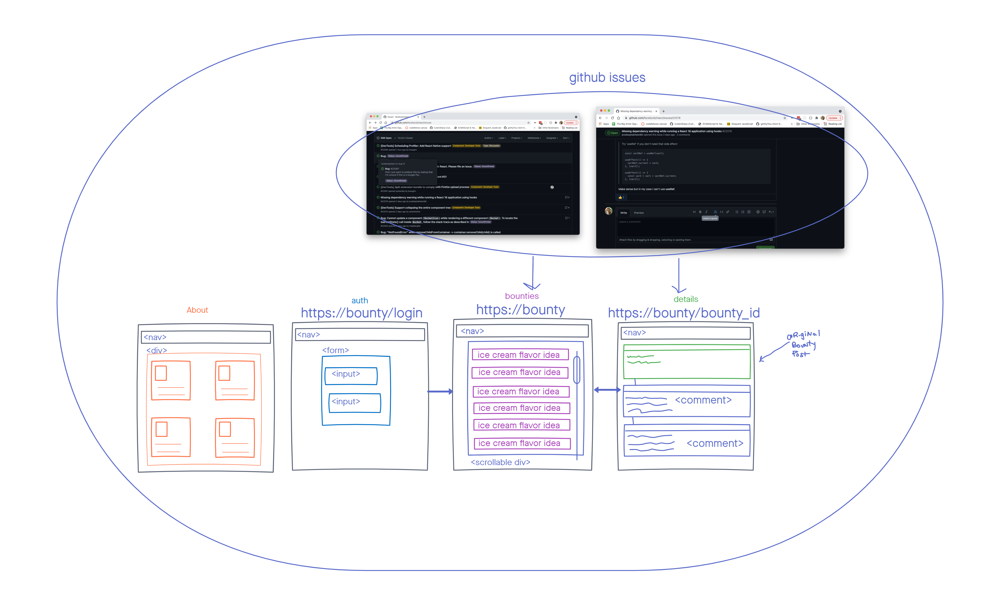

# bounty-front

# Team Cream Squad
- Cullen Sharp
- Sunny Lee
- Louis Lassgeue
- Tek Jones

## User Stories

  - [Project Board has User Stories](https://www.notion.so/User-Stories-be5412cb1ed34d62b22773eda8816897)

## UML

### Wireframe

### Domain Model

## Setup

## Technologies

- [React]()
- [React Router]()
- [Redux Tool Kit]()
- [Redux-Thunk]()
- [React-Redux]()
- [Node Sass]()
- [Axios]()
- [React test libary]()
- [Jest]()
- [Eslint]()
- [Netlify]()
- [Notion]

## Links
- [Project Management Board](https://www.notion.so/Cream-Squad-2eecc388ea1a4a70b6992435f3e885a8)
- [Bounty backend code](https://github.com/Creams-Quad/bounty-back)
- [Bounty Website]()
