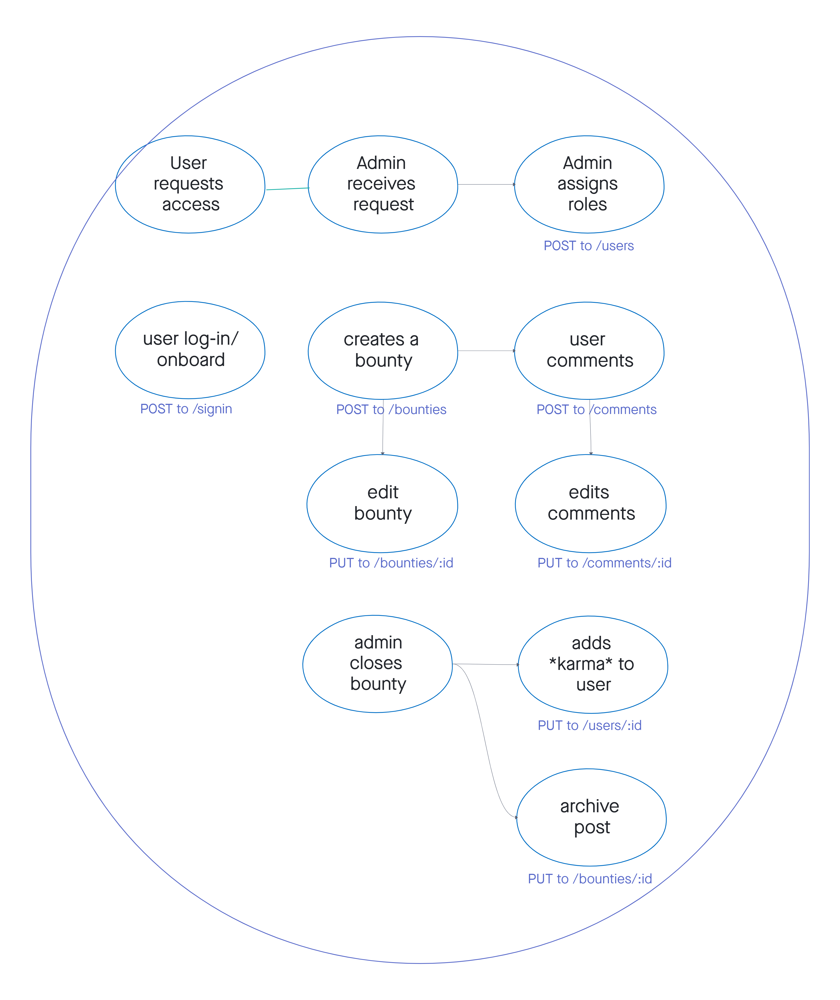

# Software Requirements

## Vision
- A social network to solve ice cream problems.
- Exploring and sharing ideas for different ingredients for ice cream
- Our app allows users to fulfill ice cream base fantasies.

## User Stories
1. Inquisitive user (Reader)

  - As an inquisitive user I want to discuss different recipes that haven't been created yet.
  - Explore the list of bounties and then access the descriptions to see the recipes
  - Can share opinions

2. Bounty poster (Creator & Deleter & Reader)

  - As the person that posted a bounty I want to share my ideas.
  - Add a bounty.
  - Read other opinions.

3. Bounty hunters (Updater & Reader)

  - As a bounty hunter I want to read the recipe and then create the recipe.
  - Marks bounties as completed.
  - Able to read the opinions for the completed recipe.

4.  Guild Master

  - As a guild master I want to check for completed recipes and move it to the completed recipes list.
  - Move completed bounties to completed list.
  - Able to check to see if bounties are completed.

5. Competitive bounty hunter

  - As a competitive bounty hunter I want to create as many valid recipes to collect karma
  - Collect karma for each recipe made
  - Build karma for reputation

## Scope(In/Out)
- In: What will your product do
  - App allow user to discuss different recipes that haven't been created yet.
  - App allow user to read the recipe and then create the recipe
  - App allow user to explore the list of bounties and then access the descriptions to see the recipes
  - App allow user to share opinions
  - App allow user to create as many valid recipes to collect karma 

- Out: What will your product not do
  - App will never turn into an IOS or Android app
  - App will not allow users to be anti-social

## Minimum Viable Product (MVP)
- social network with invite only
- Explore the list of bounties 
- Access the descriptions to see the recipes
- Share 
  - opinions
  - ideas
- Create recipes
- Collect karma for each recipe made
- Build karma for reputation

## Stretch
- Being able to close your post
- Leader board for karma
- Contributor avatar
- User list (about page for all users)
- Easter Eggs

## Functional Requirements
- Inquisitive user (Reader)

- Bounty poster (Creator & Deleter & Reader)

- Bounty hunters (Updater & Reader)

- Guild Master (Creator & Deleter & Reader & Update)

### Data Flow

## Non-Functional Requirements

1. Behavioral testing for frontend
2. Rest API calls testing

Bounty Creme
